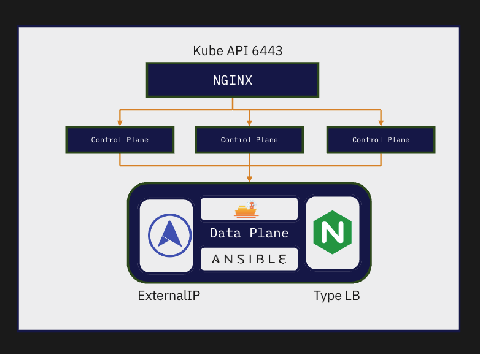

## Ansible Deployment for Kubernetes Cluster

This repository contains an Ansible inventory file, playbook, roles, and GitLab CI configuration for deploying and managing a Kubernetes cluster with Nginx and HAcluster.

### Inventory

The inventory file organizes the hosts into the following groups:

- `dev_k8s`: Parent group for all Kubernetes-related hosts.
  - `dev_k8s_node`: Child group for Kubernetes master and worker nodes.
    - `dev_k8s_master`: Group for Kubernetes master nodes.
    - `dev_k8s_worker`: Group for Kubernetes worker nodes.
  - `dev_k8s_api_lb`: Group for the Kubernetes API load balancer nodes.
### Playbook

The playbook includes the following roles for each host group:

- `dev_k8s_api_lb`:
  - `baselinux`
  - `hacluster`
  - `nginx`
- `dev_k8s_node`:
  - `baselinux`
  - `container-service`
  - `kubernetes`

### Roles

The roles are defined in the `requirements.yml` file and are sourced from Git repositories:

- `baselinux`: Base Linux configuration role.
- `container-service`: Container service role for Docker and containerd.
- `kubernetes`: Kubernetes role for deploying and configuring Kubernetes components.
- `nginx`: Nginx role for installing and configuring Nginx.
- `hacluster`: HAcluster role for setting up a high-availability cluster.

### GitLab CI

The `.gitlab-ci.yml` file defines two stages for the pipeline:

1. `ansible`: Deploy the Kubernetes cluster using Ansible.
   - Installs the required roles from `roles/requirements.yml`.
   - Executes the Ansible playbook using the `inventories/dev` inventory and the `playbooks/dev.yml` playbook.
2. `kubernetes`: Check the status of the deployed Kubernetes cluster.
   - Labels a worker node.
   - Retrieves information about the nodes and pods in the cluster.

Both stages use the `shell` and `ubuntu` tags for GitLab runners.
